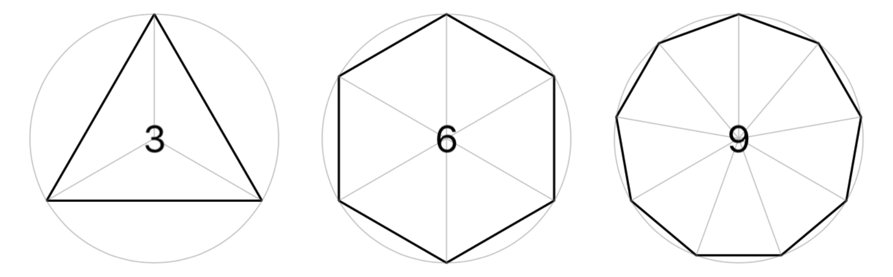
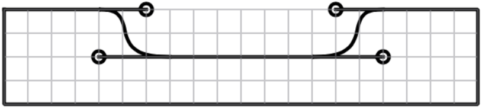
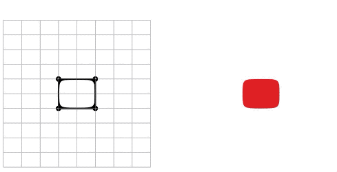
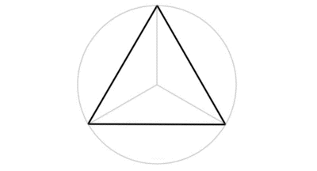
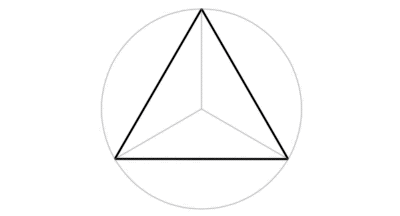
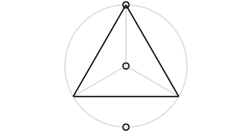
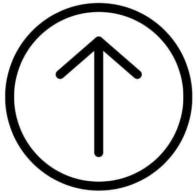
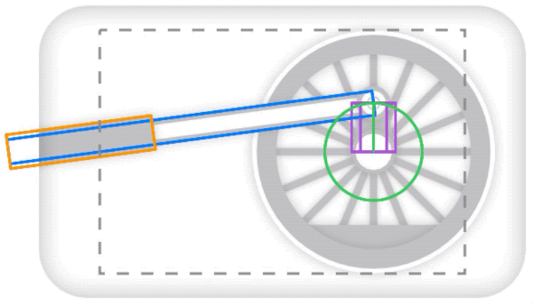

# Layout Guides

Ok, brace yourselves because things are about to get a whole lot more awesome.

  - [What is a Layout Guide?](#what-is-a-layout-guide)
  - [Drawing Polygons](#drawing-polygons)
  - [Visualizing Control Points](#visualizing-control-points)
  - [Let's Get Things Moving](#lets-get-things-moving)
  - [A Transformative Approach](#a-transformative-approach)
  - [Layout Guide Properties](#layout-guide-properties)
  - [Practical Examples](#practical-examples)
  - [Putting it all Together](#putting-it-all-together)

## What is a Layout Guide?

Layout guides are where the rubber really meets the road and will make your life *so* much easier. They essentially convert your drawing canvas into an addressable space in either a grid or a polar coordinate system. Once we have your layout you can simply use coordinates to refer to actual points as you're constructing your path. As always a picture paints a thousand words, so let's build an arrow to point you in the right direction.

<p align="center">

</p>

The code to generate this is as follows:

```swift
let gridConfig = LayoutGuideConfig.grid(columns: [0, 0.7], rows: 3)

struct PathArrowDemo: View {
    var body: some View {
        VStack {
            ArrowShape()
                .stroke(style: .init(lineWidth: 1, lineJoin: .bevel))
                .layoutGuide(gridConfig)
                .frame(150,50)
        }
    }
}

private struct ArrowShape: Shape {
    
    func path(in rect: CGRect) -> Path {
        var path = Path()
        var grid = gridConfig.layout(in: rect)
        path.move(grid[0,1])
        path.line(grid[1,1])
        path.vLine(rect.top)
        path.line(rect.trailing)
        path.line(grid[1,3])
        path.line(grid[1,2])
        path.hLine(rect.leading)
        path.closeSubpath()
        return path
    }
}
```

As you can see, there's no need to do any calculations for the locations of the points that make up the arrow - you simply refer to whatever coordinate you need and the points are calculated for you. The points themselves are calculated lazily and cached so don't worry about the framework creating loads of points in the background for your layout. You can create extremely high resolution layouts and it will only calculate the points you actually use.

There are several ways to initialize layouts; in the previous exampled I'm constructing a layout guide configuration as a grid of two columns and three rows. I am using specific ratios for the columns but splitting into three equidistant rows over the height of the `CGRect`.

The example also demonstrates the use of a **layout guide overlay**. Layout guide overlays are representations of layout guides overlaid onto the view or shape you apply the modifier to. This allows you to visualize exactly where the grid points are meaning you can use it as a map on which to draw your shape. The advantage of creating a layout guide configuration up front like this is that you can use the same specification to control the layout guide overlay.

If you wanted to, however, you could declare them both explicitly thus:

```swift
...
SomeShapeOrView()
    .layoutGuide(.grid(columns: [0, 0.7], rows: 3), color: .blue, lineWidth: 2, opacity: 0.2)
...
// and then in the Shape we could create it like so:
var grid = LayoutGuide.grid(rect, columns: [0, 0.7], rows: 3)
...
```

As you can see, you can also control other attributes of the layout guide overlay like its color, line-width, and opacity.

As a bonus you can control the visibility of these layout guides with an environment variable like so:

```swift
...
// this is false by default
.showLayoutGuides(true)
// or .environment(\.showLayoutGuides, true)
```

But there's more...

In addition to referring to points within your bespoke coordinate spaces, you can use these coordinates as a basis for *other* layout guide coordinates. In other words, you move your layout guide around another layout guide by passing in an origin for whatever point you reference, giving you infinite flexibility with minimal complexity. Let's see how you can easily create elaborate designs using this technique:

```swift
...
let numSegments = 5
var layout = LayoutGuide.polar(rect, rings: [0.75], segments: numSegments)
var layoutSmall = layout.reframed(rect.scaled(0.5, at: rect.center), origin: .center)

for segment in 0..<numSegments {
    path.move(layoutSmall[0, 0, origin: layout[0, segment]])
    for smallSegment in 0...numSegments {
        path.line(layoutSmall[0, smallSegment, origin: layout[0, segment]])
    }
}
...
```

Believe it or not, that's all the code you need to generate this result:

<p align="center">

</p>

I added a layout guide overlay on top of the preview to show how it hangs together.

This is just the tip of the iceberg of what you can achieve with a combination of layout guides and the extensions that [PureSwiftUI][pure-swift-ui] provides. In fact, since so much of the raw calculation is removed, you only have to worry about *what* you want to create, rather than *how* you're going to go about creating it. The star on this shield and the detail therein (not visible on this low-res render) was extremely simple to create; I just used a couple of polar layouts to get the job done:

<p align="center">

</p>

You can find the gist [here][gist-shield].

For segments in a polar layout guide, you can specify not only specific ratios (of revolutions), but also specific angles. The following polar layout guides are equivalent:

```swift
var polar1 = LayoutGuide.polar(rect, rings: 5, segments[0.25, 0.5])
var polar2 = LayoutGuide.polar(rect, rings: 5, segments[.cycle(0.25), .cycle(0.5)])
var polar3 = LayoutGuide.polar(rect, rings: 5, segments[.trailing, .bottom])
```

## Drawing Polygons

To give you another small taste of the flexibility that layout guides gives you, here is one last exercise where we can construct a shape using layout guides that draws a polygon with any number of sites that we want with zero calculation logic or trigonometry.

We are constructing a shape with rotational symmetry, it therefore makes sense to use a polar layout guide for this task. This will be a dynamic layout guide, so we won't construct the configuration as a global constant, but will construct one for each polygon view.

To be fair, I am only doing it this way because I want to have a layout guide overlay that shows you how the layout guides look. If we didn't want the overlay, we could just construct the layout guide in the shape itself. Let's start with the `Shape` and work our way up. Here is the entire implementation of the shape view for this task:

```swift
private struct PolygonShape: Shape {
    let layoutConfig: LayoutGuideConfig
    func path(in rect: CGRect) -> Path {
        var path = Path()
        var polar = layoutConfig.layout(in: rect)
        path.move(polar[1, 0])
        for segment in 1..<polar.yCount {
            path.line(polar[1, segment])
        }
        path.closeSubpath()
        return path
    }
}
```

You can see that I am just iterating over the number of segments by referring to the `yCount` of the layout guide. The reason it is called the `yCount` rather than `segments` is because it is a y coordinate count. When you refer to a coordinate in a layout guide, you use an x and a y value. So whether you are using a polar layout guide with rings and segments, or a grid layout guide with columns and rows, they both have an `xCount` and a `yCount` for API consistency.

So once we have constructed our shape, we can just use it in a view like this:

```swift
private struct PolygonView: View {
    let polarLayoutConfig: LayoutGuideConfig
    let numSides: Int
    init(numSides: Int) {
        polarLayoutConfig = LayoutGuideConfig.polar(rings: 1, segments: numSides)
        self.numSides = numSides
    }
    var body: some View {
            PolygonShape(layoutConfig: polarLayoutConfig)
                .stroke(style: .init(lineJoin: .bevel))
                .layoutGuide(polarLayoutConfig)
                .overlay(Text(numSides.asString))
    }
}
```

And since this view takes a number of sides as an argument, we can put it in a little `HStack` like so:

```swift
struct PolygonExtensionDemo: View {
    var body: some View {
        HStack(spacing: 20){
            ForEach(1..<4) { index in
                PolygonView(numSides: index * 3)
            }
        }
        .padding()
    }
}
```

And we end up with the following result:

<p align="center">

</p>

So you can imagine that by using and combining layout guides it's a fairly simple process to create even the most complex designs while only focusing on the design and not worrying about how to figure out the locations of the points involved. 

**Important:** Layout guides must **not** be declared as constants because they do not do calculate points eagerly and each point access is a mutating operation. This is why there is no performance penalty in creating grids with high resolutions. Only the points you access will be created and cached, and not until you access them. So if you try to use a layout guide created as a constant the compiler will go mad until you resolve the situation.

## Visualizing Control Points

One of the more challenging aspects of creating shapes is when you need to deal with control points on a curve. [PureSwiftUI][pure-swift-ui] allows you to see the control points *as you are creating your curve* which takes the guesswork out of the whole endeavor. This works by passing in a boolean to the curve functions. We can build a notch showing control points like this:

```swift
...
var grid = LayoutGuide.grid(rect, columns: 20, rows: 4)

path.move(rect.topLeading)
path.line(grid[4, 0])
path.curve(grid[7, 2], cp1: grid[6,0], cp2: grid[4,2], showControlPoints: true)
path.line(grid[13, 2])
path.curve(grid[16, 0], cp1: grid[16,2], cp2: grid[14,0], showControlPoints: true)
path.line(rect.topTrailing)
path.line(rect.bottomTrailing)
path.line(rect.bottomLeading)
path.line(rect.topLeading)
...
```

Resulting in the following output:

<p align="center">

</p>

So while designing you get a good sense of how to construct your curves and, using the layout guide, can adjust the control points appropriately.

**Important:** Control points are rendered as part of the path itself. If you don't remove them before trying to fill the shape, it will looks extremely funky. In other words, control point visualization should only really be used for design-time work.

Ok, let's do another one. To show just how much I love SwiftUI, we're going to draw a heart. In this case, we're going to use a grid layout guide with 8 columns and 10 rows which we can declare like so:

```swift
private let gridConfig = LayoutGuideConfig.grid(columns: 8, rows: 10)
```

And we're going to overlay the shape with a layout guide to make it easy for us:

```swift
HeartShape()
    .stroke(style: .init(lineWidth: 2, lineJoin: .round))
    .layoutGuide(gridConfig)
    .frame(200)

// for layout guides to be visible, remember to set the layout guide environment state:
...
.showLayoutGuides(true)
...
```

Then we use the grid to add the four curves we're going to be needing and in just a few minutes end up with:

<p align="center">

</p>

As you can see, as long as you're not using specific spacings in your layout configuration you can refer to points outside the grid - the code for drawing this heart is as simple as this:

```swift
var grid = gridConfig.layout(in: rect)
path.move(grid[0, 3])
path.curve(grid[4, 2], cp1: grid[0, 0], cp2: grid[3, -1], showControlPoints: showControlPoints)
path.curve(grid[8, 3], cp1: grid[5, -1], cp2: grid[8, 0], showControlPoints: showControlPoints)
path.curve(rect.bottom, cp1: grid[8, 5], cp2: grid[5, 7], showControlPoints: showControlPoints)
path.curve(grid[0, 3], cp1: grid[3, 7], cp2: grid[0, 5], showControlPoints: showControlPoints)
```

Then you fill it with an appropriate color, set `showControlPoints` to `false` (or remove the parameter since it's optional and defaults to false), and either remove the layout guide or set the environment state appropriately, and the result is:

<p align="center">

</p>

Not bad for just a handful of lines of code!

## Let's Get Things Moving

In addition to everything else you can declaratively animate points by using a simple function on the `CGPoint` struct, as follows:

```swift
path.line(point1.to(point2, scale))
```

Where scale describes where along the line between `point1` and `point2` you want to be. A Value of 0 would be equivalent to `point1` and a value of 1 is equivalent to `point2`. You can use any other value for your needs, but for animation it makes sense to focus on these two extremes. By driving this value off of `animatableData` you can make your paths animatable in impressive ways with virtually no added complexity. For example, I could animate the previous heart shape to a square and back for the following effect:

<p align="center">

</p>

You can find the gist [here][gist-animated-heart], although it's only 20 lines of code for the drawing section.

## A Transformative Approach

Ok, so it's really easy to draw things, and to animate the points within things, but what if you wanted to transform the layout guides themselves to expand your artistic abilities even further. No problem! The ability to scale, rotate and offset layout guides is built right in, and animatable too! Let's take a look at how that's done.

Let's start by animating everybody's favorite shape: a triangle. This is remarkably simple to do [PureSwiftUI][pure-swift-ui]. On top of the fact that drawing a triangle is so simple because you don't need to calculate any points in the code, once you have constructed your triangle you can simply animate the layout grid upon which it was constructed. Since the points that make up the triangle are based on the layout guide, when you transform the guide itself the points are transformed along with it. Therefore When you animate that transformation, the triangle is animated as a whole with no complicated transformational logic required. you simply declare what do you want to happen, and it happens.

Let's start out by defining a polar layout guide, with two rings and three segments.

```swift
let layoutGuideConfig = LayoutGuideConfig.polar(rings: 1, segments: 3)
```

We can then use this layout guide to construct a triangle like so:

```swift
func path(in rect: CGRect) -> Path {
    var path = Path()
    var polar = layoutGuideConfig.layout(in: rect)
    path.move(polar[1, 0])
    for segment in 1..<polar.yCount {
        path.line(polar[1, segment])
    }
    path.closeSubpath()
    return path
}
```

Using the same logic as we did in the [example](#drawing-polygons) above, this would obviously work for any polygon, or indeed any shape at all based on the layout guide in question. So now we have our triangle, let's animate it. We're going to start by rotating it based on some `animatableData` called `factor` in our Shape view by modifying the Shape that uses the layout guide like this:

```swift
...
var factor: Double
    var animatableData: Double {
        get {
            factor
        }
        set {
            factor = newValue
        }
    }
...
// and then modify the layout guide construction to include a rotation
// based on the factor
var polar = layoutGuideConfig.layout(in: rect)
    .rotated(360.degrees, factor: factor)
...
```

Then we modify the view that uses the shape to the following in order to animate the factor being passed to the shape:

```swift
struct AnimatedTriangleDemo: View {
    @State private var animating = false
    var body: some View {
        VStack {
            TriangleShape(factor: animating ? 1 : 0)
                .stroke(style: .init(lineJoin: .bevel))
                .layoutGuide(layoutGuideConfig)
        }
        .frame(200, 100)
        .onAppear {
            withAnimation(Animation.easeInOut(duration: 2).repeatForever(autoreverses: true)) {
                self.animating = true
            }
        }
    }
}
```
And the result is: 

<p align="center">

</p>

We can easily take this further by adding some scaling and translation by modifying the line that creates the layout guide like so:

```swift
var polar = layoutGuideConfig.layout(in: rect)
    .scaled(0.1, factor: factor)
    .yOffset(from: 0, to: rect.heightScaled(-0.45), factor: factor)
    .rotated(360.degrees, factor: factor)
```

To produce the following:

<p align="center">

</p>

Both the rotation and scaling versions allow you to specify an anchor point for the transform so there really is a lot of flexibility in the effect you want to create. It's also worth mentioning that since the transformations are just decorators for other layout guides, there is very little performance penalty involved in utilizing them as much as you like.

## Layout Guide Properties

Once layout guides are animating all over the place with scaling, rotation, and offsets, it's nice to know that you can always refer to the various `UnitPoint` properties of a layout guide and they will point at the transformed location for those points. If for example you have rotated your layout guide 180 degrees and you refer to the `.top` property, it will give you back a point that is now at the bottom. So you can always refer to these properties knowing they're going to be in the right place.

To show this in action, I've added three ellipses to the code to show the `.top`, `.center`, and `.bottom` of the layout guide as it's animating:

```swift
...
path.ellipse(polar.top, .square(5), anchor: .center)
path.ellipse(polar.bottom, .square(5), anchor: .center)
path.ellipse(polar.center, .square(5), anchor: .center)
...
```

And the result shows how these points move during the animation:

<p align="center">

</p>

## Practical Examples

With simple combinations of these transforms and relatively little effort you can create things like this:

<p align="center">

</p>

Where the rain drops are drawn on a grid with a small horizontal offset, the vertical offset is animated, and the whole thing is then rotated:

```swift
var grid = rainLayoutConfig.layout(in: rect)
    .offset(.point(-5, -rect.halfHeight))
    .offset(.y(rect.halfHeight), factor: factor)
    .rotated(-20.degrees)
```

The cloud is built on curves where I used [control point visualization](#visualizing-control-points) to help. Full gist is [here][gist-rain-icon].

Maybe you want one of those fancy state changing icons when you successfully upload something:

<p align="center">

</p>

You can achieve this effect with a combination of animating the rotation of the layout guide itself, and [animating the points](#lets-get-things-moving) within the layout guide to change the arrow into a tick. Gist [here][gist-up-arrow-to-tick-icon].

## Putting it all Together

Something that might not be obvious from this discussion is that layout guides don't exist in a vacuum. What I mean by that is that if you are using a layout guide to construct a shape, there's nothing to stop you from referring to points within other layout guides, or other layout guides that are animating! All coordinates in a layout guide give you is a `CGPoint` after all, so even if that point is moving all over the place, it's still well defined and can be used *just like any other point*. 

Here's a more complex example to demonstrate what I mean. Let's say you wanted to construct a train's wheel and a connecting rod for that wheel. In other words, something like this:

<p align="center">

</p>

There's a fair amount going on here, but it is simply constructed using the basic principle of connecting layout guides together and drawing lines between points defined within them. There are about eight different layout guides involved (both grid and polar) describing the various components, and that's fine because layout guides are cheap to create and use. Depending on the complexity of your design, use as many layout guides as you need to make the shape construction as easy as possible.

Going back to the animation, obviously the most interesting part is the connecting rod and crank because this showcases the true power of connected layout guides so let's talk about how that's done.

There are two layout guides involved for the connecting rod and crank, a grid and a polar layout. The polar layout defines the connecting point on the wheel, and the grid layout defines the connecting rod, and here's the trick: the grid layout guide's size and angle of rotation is based on the position of the point in the polar layout guide defining the crank which is itself rotating. That sounds very complicated so I've overlayed the original animation with a few of the layout guides along with the `Shape` canvas to demonstrate:

<p align="center">

</p>

So we've got the blue layout guide for the connecting rod, and the green layout guide defining the connecting point. I move the origin point for the blue layout guide so it's outside the main rectangle and then rotate it and size it based on the angle and distance from the origin point to the rotating connecting point on the wheel:

```swift
// fileprivate layout configs that will be used in multiple shape components
private let wheelOrigin = UnitPoint(0.75, 0.5)
private let connectingRodLayoutConfig = LayoutGuideConfig.grid(columns: 1, rows: 1)
private let wheelCrankLayoutConfig = LayoutGuideConfig.polar(rings: [0.4], segments: 1, origin: wheelOrigin)
...
// in connecting rod shape:

// polar layout that defines only one coordinate: the connecting point.
var polar = wheelCrankLayoutConfig.layout(in: rect)
    // rotate it by a factor defining the animation
    .rotated(360.degrees, factor: factor)

// move origin for the connecting rod layout guide outside canvas by a quarter of the width
let rodOrigin = rect.leading.xOffset(rect.widthScaled(-0.25))

// determine distance between origin and rotating connecting point
let rodLength = polar.radius(0, 0, origin: rodOrigin)

// determine the angle between origin and rotating connecting point
let rodAngle = polar.angle(0, 0, origin: rodOrigin)

// create a rectangle containing the connecting rod layout guide with
// rodOrigin on the leading point and a size determined by the distance 
// between the origin and rotating connecting point
let rodRect = CGRect(rodOrigin.yOffset(-rodHeight * 0.5), .size(rodLength, rodHeight))

// layout the guide within this rectangle
let grid = connectingRodLayoutConfig.layout(in: rodRect)
    // rotate it by the angle calculated using the leading point as an anchor
    .rotated(-90.degrees + rodAngle, anchor: .leading)

// then we just draw a rectangle around the layout guide
path.move(grid.topLeading)
path.line(grid.topTrailing)
path.line(grid.bottomTrailing)
path.line(grid.bottomLeading)
path.closeSubpath()
```

And that's as complicated as it gets. Note once again that there is no trigonometry or explicit calculations required - it's pretty much all declarative. The other components are a lot simpler. The spokes of the wheel are done like this:

```swift
// fileprivate layout config for spokes
private let wheelOrigin = UnitPoint(0.75, 0.5)
private let wheelSpokesLayoutConfig = LayoutGuideConfig.polar(rings: [0.1, 0.8], segments: 16, origin: wheelOrigin)
...
// then in spokes shape, layout the guide in the canvas
var polar = wheelSpokesLayoutConfig.layout(in: rect)
    // rotate it according to the animation factor
    .rotated(360.degrees, factor: factor)

// then draw lines for each segment
for segment in 0..<polar.yCount {
    path.line(from: polar[0, segment], to: polar[1, segment])
}
```

It's important to remember that you can have extremely complex designs but they can usually be broken down into simple components that can be represented by layout guides and therefore simple to build. You can check out the full gist [here][gist-animated-train-wheel] where you'll notice that none of the logic for each individual shape exceeds a handful of lines of code.

I hope this guide gives you an idea of the true power of drawing shapes in [PureSwiftUI][pure-swift-ui]. I look forward to seeing what you create.

<!---
 external links:
--->

[pure-swift-ui]: https://github.com/CodeSlicing/pure-swift-ui

<!---
gists:
--->

[gist-animated-heart]: https://gist.github.com/CodeSlicing/0f35b7fde16890f28e2f252a75ca0c76
[gist-rain-icon]: https://gist.github.com/CodeSlicing/e61c2d448d6c5e1e5f849e29e26e6f47
[gist-up-arrow-to-tick-icon]: https://gist.github.com/CodeSlicing/adf9bdf6539fc00b8043b6613030a821
[gist-animated-train-wheel]: https://gist.github.com/CodeSlicing/7b01216104d10378a47df0eb8723e0cd
