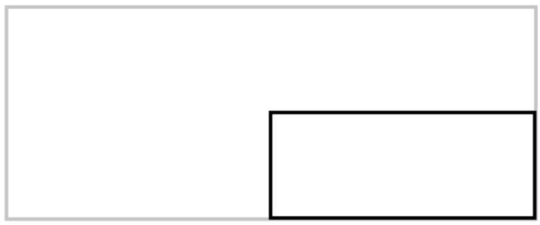
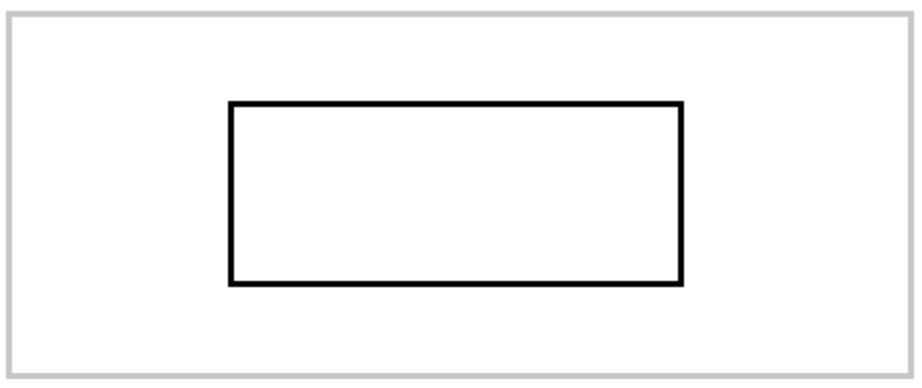
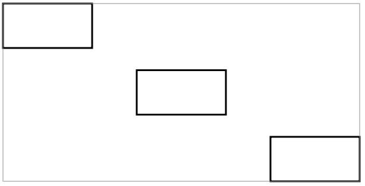
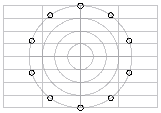

# The Path to Success

Natively, working with paths is a time-consuming task that cannot be referred to as fun. [PureSwiftUI][pure-swift-ui] aims to turn that on its head by providing a huge number of extensions and utilities that make even the most intricate path-drawing tasks a joy.

  - [Type Extensions](#type-extensions)
    - [Angle](#angle)
    - [CGRect](#cgrect)
    - [CGPoint](#cgpoint)
    - [Static Initializers](#static-initializers)
  - [Path](#path)
      - [Building Blocks](#building-blocks)
      - [Moving the Current Point and Drawing Lines](#moving-the-current-point-and-drawing-lines)

## Type Extensions

There are several aspects to making this a reality and it starts with extensions on the fundamental types used heavily in path creation, namely `Path`, `CGRect`, `CGSize`, `CGPoint`, `CGVector`, and `Angle`. A lot of time has been spent bringing these types into a sort of *synergy* with a consistent design language that flows naturally between types to the point where you don't have to *know* all the available extensions, but can reasonably guess how they hang together.

It has been the goal to remove as much calculation code as possible from the design of the `Path` itself, much in the same way that this framework cleans up views. The result is a more declarative approach to creating paths where little to no explicit calculation needs to be written to create anything from simple rectangles all the way up to elaborate designs that would previously have resulted in fairly impenetrable code.

Allow me to headline a few of the most useful extensions to give you an idea of how they fit together:

### Angle

Taking a cue from the `UnitPoint` struct, `Angle` now has constants represented by `.top`, `.leading`, `.bottomTrailing` etc pointing in the directions you would expect. It's important to note that throughout [PureSwiftUI][pure-swift-ui] an angle of *zero* points straight up. Positive angles are *clockwise* and negative angles are *anti-clockwise*. This is a subtle change from the standard in `CoreGraphics` where zero degrees points to the right. Clockwise also *means clockwise!* Always. So you don't have to do any weird visualizations in your head. Even though this is a break from the standard `CoreGraphics` library, I believe the increase in clarity more than justifies this break from absolute consistency.

In addition to the directional constants, you can now specify a fraction of a rotation by using the `.cycle(scale)` function which takes any of the major UI types and returns an `Angle` representing the multiple of a single rotation. As well as constants, you can also create angles fluently by just typing using the `.degrees` property available on all major types. This small changes makes a huge difference to readability and can of course be used anywhere in Swift.

```swift
let angleTop: Angle = .top // 0 degrees
let angleTop: Angle = .bottomLeading // 225 degrees
let angleCustom: Angle = .cycle(0.75) // 270 degrees
let angleBottomRight = 135.degrees
```

With these at your disposal, it becomes quite natural to refer to angles in this way. Once you have an `Angle` you can call trigonometric functions directly on it, like so:

```swift
let sinAngle = 30.degrees.sin
```

So if you absolutely need to perform trigonometric calculations in situ, you can see how this kind of thing can clean up your code substantially.

### CGRect

`CGRect` is a real workhorse when it comes to constructing paths. Consequentially, it has gotten a load of attention to bring the most useful properties to your fingertips. You can *easily* create regional, inset, and scaled versions of existing `CGRect` structs by using the many new functions and properties. When I spoke of synergy before, this is at play here since, like `Angle`, `CGRect` has the same `UnitPoint` inspired properties available on `Angle`.

To see this at work, let's say you wanted to create a `CGRect` struct that occupied the bottom right section of your original `CGRect`. This is how you would do it:

```swift
// native SwiftUI
let newRect = CGRect(origin: CGPoint(x: rect.midX, y: rect.midY), size: CGSize(width: rect.width * 0.5, height: rect.height * 0.5))
path.addRect(newRect)

// PureSwiftUI
path.rect(rect.scaled(0.5, at: rect.center))
```

And you get this:

<p align="center">

</p>

As you can see from the native SwiftUI implementation there's a stark difference in even this simple case. These differences really add up as the complexity of the design increases. Let's up the stakes a little and say we wanted to do the same thing, but center the resulting rectangle, like so:

<p align="center">

</p>

In doing this you quickly realise that the intent of the code is more and more obfuscated by the calculations you need to perform as well as the numerous labels:

```swift
// native SwiftUI
let newRect = CGRect(origin: CGPoint(x: rect.minX + rect.width * 0.25, y: rect.minY + rect.height * 0.25), size: CGSize(width: rect.width * 0.5, height: rect.height * 0.5))
path.addRect(newRect)

// PureSwiftUI
path.rect(rect.scaled(0.5, at: rect.center), anchor: .center)
```

In [PureSwiftUI][pure-swift-ui] you just say *what* you want, not *how* to do it.

I'd like to give one more example to really drive this point home, and to do that we're going to create this: 

<p align="center">

</p>

In native SwiftUI this is a process that involves various small calculations for origin offsets so let's take a look at the comparison:

```swift
...
// native SwiftUI
let size = CGSize(width: rect.width * 0.25, height: rect.height * 0.25)
path.addRect(CGRect(origin: rect.origin, size: size))

let center = CGPoint(x: rect.midX, y: rect.midY)
let offsetForCenterRect = CGPoint(x: center.x - size.width / 2, y: center.y - size.height / 2)
path.addRect(CGRect(origin: offsetForCenterRect, size: size))

let bottomRight = CGPoint(x: rect.maxX, y: rect.maxY)
let offsetForBottomRight = CGPoint(x: bottomRight.x - size.width, y: bottomRight.y - size.height)
path.addRect(CGRect(origin: offsetForBottomRight, size: size))

// with PureSwiftUI
let size = rect.sizeScaled(0.25)
path.rect(rect.origin, size)
path.rect(rect.center, size, anchor: .center)
path.rect(rect.bottomTrailing, size, anchor: .bottomTrailing)
```

Even is this relatively simple example, it's easy to get lost in the native SwiftUI code. In comparison I don't think it's overstating the point to say that the [PureSwiftUI][pure-swift-ui] version is practically WYSIWYG! The great news is that building paths is like joining *Lego* bricks. As each `CGRect` struct is essentially its own coordinate system, they can be used to not only construct paths, but also to navigate the canvas.

Combining this capability to the power of [layout guides][docs-layout-guides] opens the door to the true power of the [PureSwiftUI][pure-swift-ui] path construction framework.

A couple of other extensions worth mentioning are the `xScaled` and `yScaled` functions because they might not be obvious on first glance. These return the x or y position scaled along the width or height of the `CGRect` in question. So the center of the bottom-right rectangle would be described like so:

```swift
CGPoint(rect.xScaled(0.75), rect.yScaled(0.75))
```

The reason I mention them is that they take the rectangle's origin into account, so they're *not* equivalent to the `widthScaled` and `heightScaled` functions.

You can also inset rectangles in a variety of ways and they behave just like the native insets and padding in SwiftUI:

```swift
rect.insetTop(5)
rect.inset([.top, .trailing], rect.halfWidth)

// inset horizontally
rect.hInset(10)

// inset vertically
rect.vInset(10)

// inset rectangle by 10 points
rect.inset(10)
```

### CGPoint

There are *many* ways of manipulating points within a canvas. A lot of attention has been given to the ability to *derive* points from other points in order to avoid the ubiquitous calculations usually associated with constructing paths. So, like with `CGRect` once you have a point it is simple to offset those points to the locations you require.

`offset` is the function you're going to be using most when working with points. Let's go over some of the most common techniques. The simplest is to offset a point by a two dimensional struct; `CGVector`, `CGPoint`, or `CGSize`. 

```swift
// move the center of the canvas 100 points to the right and 50 points down
rect.center.offset(100, 50)
// or by supplying a vector, point or size:
rect.center.offset(CGSize(100, 50))
// or you can offset by half the size of the canvas:
rect.center.offset(rect.sizeScaled(0.5))
```

You can also restrict the offset to the x or y direction:

```swift
// offset the point by a tenth of width of the canvas
rect.center.xOffset(rect.widthScaled(0.1))
```

And if you really want to be fancy, you can offset a point by a radius and an angle: 

```swift
for cycle in stride(from: 0, through: 0.9, by: 0.1) {
    let point = rect.center.offset(radius: 100, angle: .cycle(cycle))
    path.ellipse(point, .square(10), anchor: .center)
}
```

Which gives you:

<p align="center">

</p>

I cover layout guides and their associated overlays [here][docs-layout-guides].

Feel free to browse the available extensions for [CGPoint][CGPoint], [CGVector][CGVector], [CGSize][CGSize], and [CGRect][CGRect] to see how they all tie-in to the architecture.

## Static Initializers

For all the types mentioned, there are a handful of static initializers that make code cleaner and more descriptive. For example, it is not uncommon to want to offset something in just the X axis. Of course, You could use the various `xOffset` functions, but you could also pass a `CGPoint` with x value set to the value you want to use and with a y value set to 0. You can use static initializers to do this in a descriptive way:

```swift
// offset by 10 points in x
.offset(.x(10))
// offset vertically by 10 points
.offset(.y(10))
// or you could offset with a CGPoint like so
.offset(.point(20, 10))
```

So for `CGPoint`, `CGVector`, and `CGSize` you can use static initializers that are named after the properties of the structs in question. `.dx`, `.dy`, and `.vector` for `CGVector`, and `.width`, `.height`, and `.size` for `CGSize`. The advantage goes beyond just code clarity since you also benefit from faster code completion when using statics.

### Path

Holding it all together is [Path][Path] of course, and [PureSwiftUI][pure-swift-ui] provides a plethora of extensions to reduce friction between design and code all working hand in glove with the associated extensions for the CG structs previously mentioned. It's beneficial at this point to talk about the general approach to the API so you don't have to rely on knowing them all in order to reap the benefits:

#### Building Blocks

Anything that is described by a `CGRect` like rectangles, rounded-rectangles, and ellipses, will be described as having a containing `CGRect` *or* an origin and a size. And that's it. No argument labels since they don't add additional context. Any specializations like corner radius (for rounded rectangles) will come after this with argument labels. Next is the optional `anchor` argument followed by the `transform` that defaults to the `.identity` transform a la the native SwiftUI API. You can see this in action in the previous example.

#### Moving the Current Point and Drawing Lines

These operations have essentially matching APIs. When no argument label is provided, the argument is interpreted as the final destination for the movement or line drawn. For example, to move to the bottom trailing point of the canvas and then draw a line to the top trailing corner you would do the following:

```swift
move(rect.bottomTrailing)
line(rect.topTrailing)

// you can also do this in one call like so:
line(from: rect.bottomTrailing, to: rect.topTrailing)
```

In the second technique, argument labels indicate that the supplied arguments are not a destination, but something else described by those labels. You can, for example, use offsets to describe movement or to draw a line like this:

```swift
// you can also use CGVector or CGSize for these calls
move(offset: CGPoint(5, 10))
line(offset: CGPoint(100, 50))
```

which will use the current point for the path to extrapolate the destination. If you want to restrict movement in an axis, you can use the horizontal or vertical versions of these methods:

```swift
hMove(rect.center) // same as: hMove(rect.center.x)
vLine(rect.top) // same as: vLine(rect.top.y)
```

The `at` argument label can be used to draw lines at a specific location with a specific vector, or length and angle which can then be offset by an appropriate anchor point.

```swift
// line at 30 degrees centered on the center of the canvas
line(at: rect.center, length: 100, angle: 30.degrees, anchor: .center)
// a line along the left side of the canvas
vLine(at: rect.leading, length: rect.height, anchor: .center)
```

That covers the majority of the API, but I encourage you to check out the source if you want to know more.

<!---
 external links:
--->

[pure-swift-ui]: https://github.com/CodeSlicing/pure-swift-ui
[CGSize]: https://github.com/CodeSlicing/pure-swift-ui/blob/develop/Sources/PureSwiftUI/Extensions/Convenience/CoreGraphics/CGSize%2BConvenience.swift
[CGPoint]: https://github.com/CodeSlicing/pure-swift-ui/blob/develop/Sources/PureSwiftUI/Extensions/Convenience/CoreGraphics/CGPoint%2BConvenience.swift
[CGRect]: https://github.com/CodeSlicing/pure-swift-ui/blob/develop/Sources/PureSwiftUI/Extensions/Convenience/CoreGraphics/CGRect%2BConvenience.swift 
[CGVector]: https://github.com/CodeSlicing/pure-swift-ui/blob/develop/Sources/PureSwiftUI/Extensions/Convenience/CoreGraphics/CGVector%2BConvenience.swift 
[Path]: https://github.com/CodeSlicing/pure-swift-ui/blob/develop/Sources/PureSwiftUI/Extensions/Convenience/SwiftUI/Path%2BConvenience.swift

<!---
gists:
--->

[gist-shield]: https://gist.github.com/CodeSlicing/af02bd37dd60252fd39acaf95d28a7d0

<!---
 local docs:
--->

[docs-layout-guides]: ../LayoutGuides/layout-guides.md
