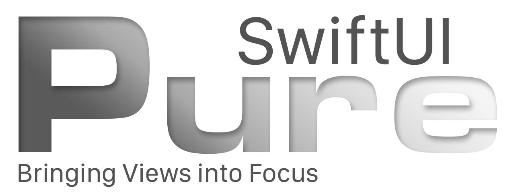
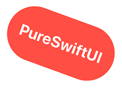
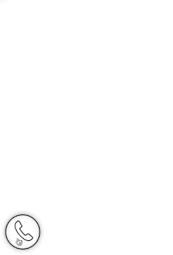
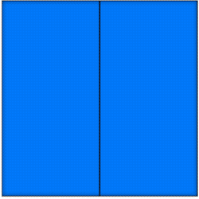
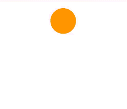

<p align="center">
<a href="https://github.com/CodeSlicing/pure-swift-ui">

</a>
</p>

[PureSwiftUI][pure-swift-ui] is a Swift package designed to enhance the experience of writing [SwiftUI][swift-ui] code. An additional goal is to make these changes as intuitive as possible, requiring little to no experience with the package to begin using its advantages in ernest.

- [Motivation](#motivation)
- [TL;DR](#tldr)
- [Intention Focused Modifiers](#intention-focused-modifiers)
- [Simplified Common Usage](#simplified-common-usage)
  - [Image Resizing](#image-resizing)
  - [Clip Shapes and Strokes](#clip-shapes-and-strokes)
  - [Frame](#frame)
- [Type Coercion](#type-coercion)
- [Navigating Coordinate Spaces](#navigating-coordinate-spaces)
  - [GeometryReader Modifier](#geometryreader-modifier)
  - [Offsets and Absolute Positioning](#offsets-and-absolute-positioning)
- [Conditional Modifiers](#conditional-modifiers)
- [Conditional Rendering](#conditional-rendering)
- [SF Symbols](#sf-symbols)
- [Preview Extensions](#preview-extensions)
- [Caveats](#caveats)
- [Installation](#installation)
- [Versioning](#versioning)
- [Version History](#version-history)
- [Licensing](#licensing)
- [Contact](#contact)

## Motivation

We all love `SwiftUI`, and what the engineers at Apple have achieved is nothing short of ground-breaking. Often, however, a `View` can become cluttered with argument labels, type coercion, and various other aspects of day-to-day `View` creation that tend to get in the way of the design. With `SwiftUI` being a _design_ language as much as anything else, [PureSwiftUI][pure-swift-ui] was created to remove as much code external to intent as possible while retaining the expressiveness of the base API. As someone who exclusively writes views in code, a secondary consideration was to reduce the amount of typing as much as possible.

## TL;DR

To demonstrate some of the advantages, let's say you want to generate the following label:

<p align="center">

</p>

The code below shows how you would generate this label, including a small offset, comparing the native `SwiftUI` code to that of [PureSwiftUI][pure-swift-ui].

```swift
//...

private let width: Double = 200
private let height: Int = 100
private let xOffset: Int = 10
private let yOffset: Double = 10
private let rotation: Int = 20
private let scale: Double = 1.1
private let opacity: Float = 0.9

//...

// native SwiftUI

Text("PureSwiftUI")
    .font(Font.title.bold())
    .foregroundColor(.white)
    .frame(width: CGFloat(width), height: height)
    .background(Color.red)
    .clipShape(Capsule())
    .overlay(Capsule().stroke(Color.black, lineWidth: 4))
    .rotationEffect(.degrees(Double(rotation)))
    .offset(x: CGFloat(xOffset), y: CGFloat(yOffset))
    .scaleEffect(CGFloat(scale))
    .opacity(Double(opacity))

// with PureSwiftUI

TitleText("PureSwiftUI", .white, .bold)
    .frame(width, height)
    .clipCapsuleWithStroke(.black, lineWidth: 4, fill: Color.red)
    .rotate(rotation.degrees)
    .offset(xOffset, yOffset)
    .scale(scale)
    .opacity(opacity)
```

As you can see the difference is dramatic, favouring design over implementation boiler-plate. 

## Intention Focused Modifiers

As shown in the previous example, by removing many of the explicit [argument labels][swift-functions], the clarity of the code is increased. In most cases the modifier name is expressive enough to document the code without needing argument labels. Including them, in my opinion, only reduces readability.

Since these modifiers are used frequently by even casual coders, it's reasonable to assume that familiarity with how they behave is more than enough to bridge any reduction in auto-documentation.

For example, if you only want to set the width and offset something horizontally you would do this in `SwiftUI` natively:

```swift
.frame(width: 100)
.offset(x: 50)
```

With argument labels, about a third of this code could be considered _noise_. In addition, you're calling the `frame` modifier, but you only want to set the _width_. [PureSwiftUI][pure-swift-ui] tackles this in the following way:

```swift
.width(100)
.xOffset(50)
```

Another area that is improved is for components that don't expand to fill all available space by default; `Text` is a good example of this. Ordinarily you would achieve this like so:

```swift
Text("Some expanding text")
    .frame(maxWidth: .infinity, maxHeight: .infinity)
```

This is accomplished in the following way in [PureSwiftUI][pure-swift-ui]:

```swift
Text("Some expanding text")
    .greedyFrame() // or .greedyWidth / .greedyHeight
```

which I believe is a clearer expression of the intent.

## Simplified Common Usage

### Image Resizing

When using images we almost always set the image to resizable, then we set the scaling aspect ratio followed by the frame size. [PureSwiftUI][pure-swift-ui] packages this into one simple yet descriptive modifier: 

```swift
// native SwiftUI
Image("my-image")
    .resizable()
    .scaledToFill() // or scaledToFit
    .frame(width: 200, height: 100)

// with PureSwiftUI
Image("my-image")
    .resizedToFill(200, 100) // or resizedToFit
```

### Clip Shapes and Strokes

Now I realise that clipping a shape is no great hardship. However, providing dedicated modifiers for each shape also allows for the content to be matched to that shape. In other words by using a specific clip shape modifier you don't need to restrain the content in a separate step (This can be set to unconstrained if required).

So the following code achieves the same result:

```swift
// native SwiftUI
.clipShape(RoundedRectangle(cornerRadius: 10))
.contentShape(RoundedRectangle(cornerRadius: 10))

// with PureSwiftUI
.clipRoundedRectangle(10)
```

Going further, stroking and filling shapes is a regular operation that results in rather obfuscated code once again detracting from the intent: to create a stroked shape. Going back to the example from the tl;dr section, if you ignore the transformative modifiers and just look at the styling, you can see what a difference it can make: 

```swift
... properties

// native SwiftUI
Text("PureSwiftUI")
    .font(Font.title.bold())
    .foregroundColor(.white)
    .frame(width: CGFloat(width), height: CGFloat(height))
    .background(Color.red)
    .clipShape(Capsule())
    .overlay(Capsule().stroke(Color.black, lineWidth: 4))

// with PureSwiftUI
TitleText("PureSwiftUI", .white, .bold)
    .frame(width, height)
    .clipCapsuleWithStroke(.black, lineWidth: 4, fill: Color.red)
```

Not only is the code more understandable, but it's also a lot quicker to write!

### Frame

`Frame` is a concept in [PureSwiftUI][pure-swift-ui] that embodies a region of a certain size. Oftentimes we find ourselves writing some styling code for a simple `RoundedRectangle` with a blue background color in one variation of the following:

```swift
// native SwiftUI
Color.blue
    .frame(width: 100, height: 60)
    .cornerRadius(10)

RoundedRectangle(10)
    .fillColor(.blue)
    .frame(width: 100, height: 60)

Spacer()
    .frame(width: 100, height: 60)
    .background(Color.blue)
    .cornerRadius(10)
```

So far so normal. But all we want is a frame of a certain size, and this inconsistency betrays the intention. Is it a `Rectangle`? A `Color`? A `Spacer`? No, it's just a frame, so for this kind of scenario - and it comes up *a lot* - you can simply use `Frame` like so:

```swift
Frame(100, 60, .blue)
    .cornerRadius(10)
```

The same argument types can be passed to `Frame` that can be passed to the `frame` modifier extensions so it's extremely flexible, descriptive, and concise.

## Type Coercion

Coercing variables can also lead to obfuscated design. In many common use-cases, with [PureSwiftUI][pure-swift-ui] you don’t have to worry about passing specifically typed parameters. As long as your variable is an `Int`, `Double`, `Float`, or `CGFloat`, you’re fine. In most cases you can mix types in the same modifier.

```swift
let width: Double = 200
let height = 100

//...

// native SwiftUI
.frame(width: CGFloat(width), height: CGFloat(height))

// PureSwiftUI
.frame(width, height)
```

## Navigating Coordinate Spaces

### GeometryReader Modifier

A common issue when using `GeometryReader` is that it is a view that will grab all available space in the parent, much like `Color`. This means when we wrap a View or element that takes up less space than is offered by the parent in a `GeometryReader` we essentially *change* the layout which of course is undesirable. 

The [PureSwiftUI][pure-swift-ui] to this problem is the `geometryReader` modifier that calls back with the same `GeometryProxy` object that can be probed for sizing or location information specifically for the view in question without affecting the layout, like so:

```swift
Text("What's my size?")
    .geometryReader {(geo: GeometryProxy) in
        //geo.size
        //geo.localMidX
        //geo.localCenter
        //geo.globalMinX
        //etc
    }
```

As an aside, there are numerous `GeometryProxy` extensions in [PureSwiftUI][pure-swift-ui] giving access to the various local or global frames for convenience. 

The ability to constrain `GeometryReader` in this way is utilised to provide some powerful modifiers. 

### Offsets and Absolute Positioning

While you can of course position elements to your heart's desire, this will fundamentally change the layout of the View in question. On top of that, you cannot *conditionally* place something, since the `position` modifier requires a default value to fall back on, which would be the original position of the View. You can obtain this using the geometryReader, but there's a problem. By manually setting the position, the origin changes!

To combat this problem, [PureSwiftUI][pure-swift-ui] offers the `offsetToPosition` modifier allowing you to set the position of a View to an absolute position within any coordinate space without the need to know anything about the current position or size of the View you're offsetting. There are of course extensions for conditional flavours of this modifier as well as restricting the movement to the x or y axis.

Additionally you are able to specify an anchor to which to apply the positional offset. If I wanted to conditionally place the bottom trailing corner of my View to the origin of a namespace called "outer" I would only have to do the following:

```swift
MyView()
    .offsetToPositionIf(condition, 0, 0, in: "outer", anchor: .bottomTrailing)
```
In this example, I'm conditionally offsetting the position of the dialer buttons to the position of the phone toggle button:

<p align="center">

</p>

You can find a gist for this [here][gist-offset-to-position-demo] but the important bit is:

```swift
DialerButton()
...
    .offsetToPositionIfNot(showingDialer, phoneButtonPosition)
```

Since there's no need to perform any offset calculations, I can simply arrange the dialer buttons how I would do normally, and offset them when required.

Another helpful extension is the `relativeOffset` modifier and the various related signatures. This facilitates offsetting Views based on the size of the View being offset. So you specify a fraction, and the appropriate offset is applied.

In the following example, I'm offsetting each of the four blue rectangles by 80% of their respective widths of heights:

<p align="center">

</p>

The gist is [here][gist-relative-offset-demo] but the relevant code is as follows:

```swift
Frame(boxSize / 2, boxSize, .blue)
...
    .relativeXOffsetIf(self.open, 0.8)
```

These modifiers remove the need to externalize any offset vs positional calculations keeping the intent of the code clean and free from distraction.

## Conditional Modifiers

With liberal use of the ternary operator it is of course possible to conditionally style components based on the current state, but oftentimes the default value of the modifier is used as the _off_ state. In other words, keeping the default value as part of the display logic only serves to distract from the intent.

Consider the following example that sets the opacity of a component depending on whether or not it is disabled:

```swift
@State private var disabled = false

//...

.opacity(disabled ? 0.4 : 1)
```

Standard right? However, since the enabled state reverts to the default value for `opacity` this code explicitly includes a redundant `else` clause and is the semantic equivalent to the following:

```swift
if disabled {
    opacity = 0.4
} else {
    // do nothing
}
```

This isn't something we would reasonably do in non-`SwiftUI` code, and obscures the important part: that opacity is _only_ modified in the disabled state. [PureSwiftUI][pure-swift-ui] avoids this predicament by providing conditional modifiers, so the previous code-block would be written in this way:

```swift
@State private var disabled = false

//...

.opacityIf(disabled, 0.4)
```

We therefore avoid unnecessary references to default values and reduce friction to understanding the purpose of the code. It is also fully animatable, so you don't lose anything but baggage. In addition, since the `!` operator can be easy to miss, modifiers are provided for the negative case, like so:

```swift
@State private var enabled = false

//...

.opacityIfNot(enabled, 0.4)

// vs natively
.opacity(!enabled ? 0.4 : 1)

//or
.opacity(enabled ? 1 : 0.4)
```

There are a number of conditional modifiers to explore; just type `.if` and see what comes up.

An example here can show how [PureSwiftUI][pure-swift-ui] can have a *huge* impact on both code-clarity and efficiency. Imagine we wanted to produce the following rather contrived example:

<p align="center">

</p>

The code for doing that is shown below in both native SwiftUI and [PureSwiftUI][pure-swift-ui] styles:

```swift
// native SwiftUI
Rectangle()
    .fill(Color.orange)
    .frame(width: modified ? 200 : 50, height: modified ? 100 : 50)
    .clipShape(RoundedRectangle(25))
    .overlay(RoundedRectangle(25).stroke(Color.black, lineWidth: 5))
    .rotationEffect(.degrees(modified ? 180 : 0))
    .offset(y: modified ? 100 : 0)
    .hueRotation(.degrees(modified ? 360 : 0))
    .opacity(modified ? 0.5 : 1)

// with PureSwiftUI
Color.orange
    .frameIf(modified, 200, 100)
    .frameIfNot(modified, 50)
    .clipRoundedRectangleWithStroke(25, .black, lineWidth: 5)
    .rotateIf(modified, 180.degrees)
    .yOffsetIf(modified, 100)
    .hueRotationIf(modified, 360.degrees)
    .opacityIf(modified, 0.5)
```

In my opinion, the latter version is significantly more declarative and therefore readable.

## Conditional Rendering

`SwiftUI` of course allow you to render components using conditional logic, and that's fine. Nevertheless this also involves the use of a `Group` that isn't relevant to the purpose since we are forced to adhere to the opaque return type of `body`:

```swift
@State private var toggle = false

//...

// native SwiftUI
var body: some View {
    Group {
        if toggle {
            Text("It's true")
        } else {
            SFSymbol(.nosign)
        }
    }
}
```

The `Group` is not part of the design, but it has to be there - assuming we're not type-erasing our components. `RenderIf` on the other hand _is_ a `View`, so we can simply return it directly achieving the same result, like so:

```swift
@State private var toggle = false

//...

// using RenderIf
var body: some View {
    RenderIf(toggle) {
        Text("It's true")
    }.elseRender {
        SFSymbol(.nosign)
    }
}
```

Furthermore, since `RenderIf` is a `View`, modifiers can be applied directly to it and will affect whichever `View` is ultimately resolved. `RenderIf` can be used without the `else` clause if required, however at this point there is no support for `else if` clauses.

## SF Symbols

While SF symbols are a fantastic addition to the framework, none of us likes a stringly typed API, amirite? The process of finding the appropriate symbol using the [SF Symbols][sf-symbols] app and copying the appropriate string into your code is laborious, error-prone, and does not of course provide any type checking. There is also no way - just from looking at the code - of knowing which symbols are restricted in their usage without referring back to the SF Symbols app, or checking out the [SF Symbols Reference][sf-symbols-reference] guide.

Is the following symbol name correct, or restricted in any way?

```swift
Image(systemName: "pencil.circle")
```

Maybe; I'd have to check the documentation. Whereas with [PureSwiftUI][pure-swift-ui] the first question is moot, and the answer to the second question is clear:

```swift
SFSymbol(.pencil_circle)
SFSymbol(.🍏pencil_tip)

// or using an Image directly
Image(sfSymbol: .pencil_circle)
Image(sfSymbol: .🍏pencil_tip)
```

Since all SF symbols are available as constants, there is also the option of using fuzzy searching to find a symbol you like the look of in the preview without the need to leave Xcode.

Yet another advantage, is that the symbol constants defined in [PureSwiftUI][pure-swift-ui] are aware of deprecation so if a symbol you're using has been superseded by a new symbol name, you will get a warning including a suggestion of what to use instead, assuming one exists.

## Preview Extensions

As with SF Symbols, this is once again a stringly typed interface that [PureSwiftUI][pure-swift-ui] does away with. Rather than guessing which device strings are accepted, you can pass in a constant to the `previewDevice` modifier like so:

```swift
MyView.previewDevice(.iPhone_8_Plus)
```

This has the added benefit of naming the previews based on the device specified, unless you want to override it with your own name of course.

You can also conditionally (or not) set dark mode for a preview device without the need to use the `\.colorScheme` keypath by using the following:

```swift
MyView.envDarkMode()

// or conditionally
MyView.envDarkModeIf(condition) // or envDarkModeIfNot
```

## Caveats

Although [PureSwiftUI][pure-swift-ui] exports `SwiftUI` - meaning you don't need to import `SwiftUI` at the top of your views for compilation - unfortunately at the time of writing previews do not work if you are not explicitly importing `SwiftUI`. Hopefully this will be addressed in a future release.

## Installation

The `pure-swift-ui` package can be found at:

<https://github.com/CodeSlicing/pure-swift-ui.git>

Instructions for installing swift packages can be found [here][swift-package-installation].

## Versioning

This project adheres to a [semantic versioning](https://semver.org) paradigm. I'm sure a lot will change after WW20, so that's probably when version 2.0.0+ will appear.

## Version History

- [1.0.0][tag-1.0.0] Commit initial code
- [1.1.0][tag-1.1.0] Update SFSymbols to latest version (1.1 (16))
- [1.2.0][tag-1.2.0] Add constants for preview device names and add support for SFSymbolName to UIImage
- [1.3.0][tag-1.3.0] Add deprecated SFSymbols with availability
- [1.4.0][tag-1.4.0] Add alignment to greedy modifiers and Image specific modifiers to SFSymbol
- [1.5.0][tag-1.5.0] Add numerous modifiers and conditional modifiers including hueRotation, GeometryProxy extensions, Shape specific modifiers, UIScreen and more
- [1.6.0][tag-1.6.0] Add image processing modifiers and associated conditionals - add convenience modifiers to Image and SFSymbol to perform resizing and aspect ratio modifiers in one step
- [1.7.0][tag-1.7.0] Add constructor function for SFSymbols and all font types. Alignment parameter for all frame modifiers. Overloads for all font type modifiers on Text. Conditional animation modifier. Align modifier for Text.
- [1.8.0][tag-1.8.0] Add various clip shape modifiers - extensions for stroking with fill - fill styles - default corner style to circular for RoundedRectangle - conditional background modifiers
- [1.9.0][tag-1.9.0] Add conditionals for overlays and borders - add iPhone 11 preview devices - add shadow modifier overloads
- [1.10.0][tag-1.10.0] Add Frame concept, color name overloads, env and preview modifiers for convenience
- [1.11.0][tag-1.11.0] Add geometryFrame modifier as well as relativeOffset and offsetToPosition modifiers
- [1.12.0][tag-1.12.0] Add font modifiers for all font styles to Text and View as well as associated constructor functions

## Licensing

This project is licensed under the MIT License - see [here][mit-licence] for details.

## Contact

You can contact me on Twitter [@CodeSlice][codeslice-twitter]. Happy to hear suggestions for improving the package, or feature suggestions. I've probably made a few boo boos along the way, so I'm open to course correction. I won't be open-sourcing the project for the moment since I simply don't have time to administer PRs at this point, though I do intend to do so in the future if there's enough interest.

<!---
 external links:
--->

[pure-swift-ui]: https://github.com/CodeSlicing/pure-swift-ui
[sf-symbols]: https://developer.apple.com/design/human-interface-guidelines/sf-symbols/overview/
[sf-symbols-reference]: https://sfsymbols.com
[codeslice-twitter]: https://twitter.com/CodeSlice
[swift-ui]: https://developer.apple.com/xcode/swiftui/
[swift-functions]: https://docs.swift.org/swift-book/LanguageGuide/Functions.html
[swift-package-installation]: https://medium.com/better-programming/add-swift-package-dependency-to-an-ios-project-with-xcode-11-remote-local-public-private-3a7577fac6b2

<!---
gists:
--->

[gist-offset-to-position-demo]: https://gist.github.com/CodeSlicing/2c5376552fa8c27456925370403caa46
[gist-relative-offset-demo]: https://gist.github.com/CodeSlicing/6873695fd0113c27d5cdd8591eca9d1d

<!---
version links:
--->

[tag-1.0.0]: https://github.com/CodeSlicing/pure-swift-ui/tree/1.0.0
[tag-1.1.0]: https://github.com/CodeSlicing/pure-swift-ui/tree/1.1.0
[tag-1.2.0]: https://github.com/CodeSlicing/pure-swift-ui/tree/1.2.0
[tag-1.3.0]: https://github.com/CodeSlicing/pure-swift-ui/tree/1.3.0
[tag-1.4.0]: https://github.com/CodeSlicing/pure-swift-ui/tree/1.4.0
[tag-1.5.0]: https://github.com/CodeSlicing/pure-swift-ui/tree/1.5.0
[tag-1.6.0]: https://github.com/CodeSlicing/pure-swift-ui/tree/1.6.0
[tag-1.7.0]: https://github.com/CodeSlicing/pure-swift-ui/tree/1.7.0
[tag-1.8.0]: https://github.com/CodeSlicing/pure-swift-ui/tree/1.8.0
[tag-1.9.0]: https://github.com/CodeSlicing/pure-swift-ui/tree/1.9.0
[tag-1.10.0]: https://github.com/CodeSlicing/pure-swift-ui/tree/1.10.0
[tag-1.11.0]: https://github.com/CodeSlicing/pure-swift-ui/tree/1.11.0
[tag-1.12.0]: https://github.com/CodeSlicing/pure-swift-ui/tree/1.12.0

<!---
 local docs:
--->

[mit-licence]: ./Assets/Docs/LICENCE.md
